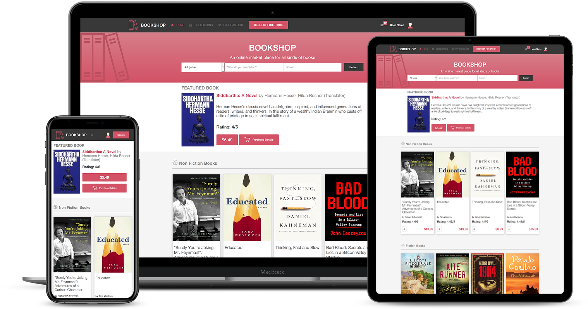
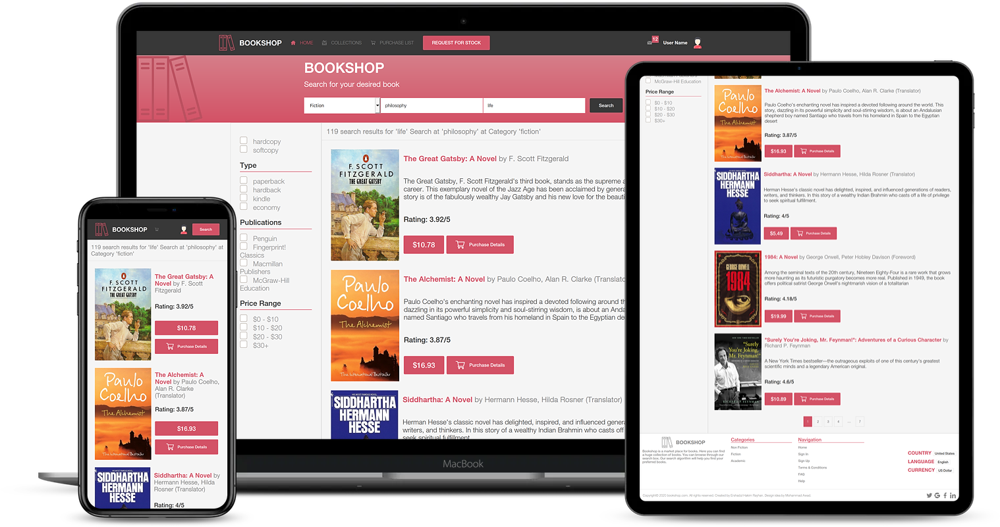

# HTML-CSS CAPSTONE 'BOOKSHOP' 🚧

## Project Description

> This is an online market place for books. It has two pages homepage and search page. The homepage shows 
> different categories of books. The search page has a filter side bar. 

> I followed [this](https://www.behance.net/gallery/24796463/ZATTIX) design created by [Mohammed Awad](https://www.behance.net/M_Awad)
> and created this bookshop project.

- Homepage

- Search page

## Built With 🧰

- HTML
- CSS

## Live Demo 🔴

[Live Demo Link](https://gracious-goldberg-aefc53.netlify.app/)

## Getting Started 🏁

To get a local copy up and running follow these simple example steps.

### Prerequisites

If you are viewing this README.md file using a computer, a browser and a connection to the internet, then congratulations! You have all the prerequisites to access our project.

### Setup

1. Clone the repository to your local machine using `git clone git@github.com:ershadul1/HTML-CSS-Capstone.git`
2. On your local machine, navigate to the HTML-CSS-Capstone folder using `cd HTML-CSS-Capstone` in your terminal
3. Once the repository has been cloned, open index.html in a browser of your choosing.
4. Enjoy!

## Author

👤 **Ershadul Hakim Rayhan**

- Github: [@ershadul1](https://github.com/ershadul1)
- Twitter: [@ErshadulRayhan](https://twitter.com/ErshadulRayhan)
- Linkedin: [ErshadulRayhan](https://www.linkedin.com/in/ershadulrayhan)
- Email:  ershadul.rayhan@gmail.com

## 🤝 Contributing

There are two ways of contributing to this project:

1.  If you see something wrong or not working, please check [the issue tracker section](https://github.com/ershadul1/HTML-CSS-Capstone/issues), if that problem you met is not in already opened issues then open the issue by clicking on `new issue` button.

2.  If you have a solution to that, and you are willing to work on it, follow the below steps to contribute:
    1.  Fork this repository
    1.  Clone it on your local computer by running `git clone git@github.com:ershadul1/HTML-CSS-Capstone.git` __Replace *ershadul1* with the username you use on github__
    1.  Open the cloned repository which appears as a folder on your local computer with your favorite code editor
    1.  Create a separate branch off the *master branch*,
    1.  Write your codes which fix the issue you found
    1.  Commit and push the branch you created
    1.  Raise a pull request, comparing your new created branch with our original master branch [here](https://github.com/ershadul1/HTML-CSS-Capstone)
## Show your support

Give a ⭐️ if you like this project!

## Acknowledgments

- [Microverse](https://www.microverse.org/)
- [Mohammed Awad's Design](https://www.behance.net/gallery/24796463/ZATTIX)
- VSCode <3

## 📝 License

This project is [MIT](lic.url) licensed.
